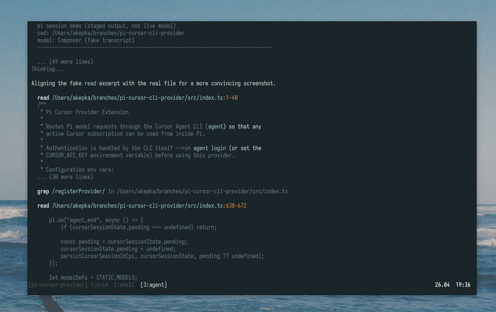

<p align="center">
  
</p>

# pi-cursor-cli-provider

<p align="left">
  <a href="https://www.npmjs.com/package/@akepka/pi-cursor-cli-provider">
    
  </a>
</p>

A [Pi Coding Agent](https://github.com/badlogic/pi-mono) custom provider that routes model requests through the **Cursor
CLI**, enabling you to use your Cursor subscription inside Pi.

This project is a heavily modified fork of [netandreus/pi-cursor-provider](https://github.com/netandreus/pi-cursor-provider).

<p align="center">
    <a href="./screenshot.png">
      
    </a>
</p>

# Motivation

(if you don't feel like reading all this, go straight to [Installation](#installation))

I spent a long time looking for a proper Cursor provider for Pi, but the ones that worked best were too "hacky" in my
opinion - they used the reverse-engineered API to call Cursor endpoints directly, masquerading as the legitimate Cursor
CLI. They also had various issues, such as not passing the system prompt properly.

I also tried to write my own extension based on the [ACP protocol](https://agentcommunicationprotocol.dev/). I even got
it to the point where I could use it with Cursor - but Cursor does not expose all models through ACP. And the ones it
does expose are available in only one variant - for example, only with "medium" thinking. That makes this approach, in my
opinion, unusable.

After all that, I stumbled upon [netandreus/pi-cursor-provider](https://github.com/netandreus/pi-cursor-provider). It
worked, and most importantly, it used the legitimate Cursor CLI without any hacks. But it was not super polished—tool
call rendering was basically just raw text, all session history was sent as a prompt on every turn, images were not
supported, etc. Still, the idea was cool, so I decided to build on top of it.

# Installation

### npm

```bash
pi install npm:@akepka/pi-cursor-cli-provider
```

### git

```bash
pi install git:github.com/Strus/pi-cursor-cli-provider
```

For the extension to work, **you need to have [Cursor CLI](https://cursor.com/docs/cli/installation) installed and
authenticated**. Authentication can be done either with the `agent login` command or with a token generated from the
Cursor dashboard and set as the `CURSOR_API_KEY` environment variable. See the [Cursor CLI docs](https://cursor.com/docs/cli/reference/authentication) for more
information.

# Usage

Just start Pi and everything should work. Models are auto-discovered on startup, so you can choose them with
`/models` or `/scoped-models` as usual. Pi's thinking effort settings are mapped to Cursor model names - you choose the
base model name and set the thinking level with `shift-tab`, as you normally would.

# How it works

Each Pi turn spawns a Cursor Agent CLI subprocess. The first turn sends the full Pi transcript; later turns resume the
saved Cursor chat session and send only the newest user prompt:

```bash
agent --print --yolo --output-format stream-json --model <id> --trust --workspace <cwd> "<full prompt>"

# later turns
agent --print --yolo --output-format stream-json --model <id> --resume <session-id> --trust --workspace <cwd> "<latest user prompt>"
```

Cursor session IDs are saved and associated with Pi session IDs. Thanks to that, even if you resume the Pi session, the
provider does not need to send the full conversation to Cursor CLI again, but can resume the Cursor session too.

The CLI's NDJSON stdout is read line by line, and its output is mapped, when possible, to Pi native rendering elements
(for example, thinking blocks).

Cursor CLI supports images when you provide a file path to them, so images pasted into Pi are supported out of the box,
as Pi provides the path to a temporary file when you paste an image. In non-interactive mode, if the prompt contains a
blob of image data, that data is saved as a temporary file, and the path to that file is then passed to the Cursor CLI.

# Installing and enabling MCP tools in Cursor Agent for Pi

To use Pi-related MCP tools (e.g. `pi-auto`) when the Cursor Agent runs on behalf of Pi, connect the MCP server, enable
it for the agent, and allow its tools in the CLI config.

### 1. Connect MCP server to agent

Add the server to `~/.cursor/mcp.json`. Example for `pi-auto`:

```json
{
  "mcpServers": {
      "pi-auto": {
          "command": "pi-auto-mcp",
          "lifecycle": "keep-alive",
          "directTools": true
      }
  }
}
```

### 2. Enable the MCP server

List MCP servers; new ones need approval:

```bash
agent mcp list

# Example output: pi-auto: not loaded (needs approval)
```

Enable and approve the server:

```bash
agent mcp enable pi-auto

# Example output: ✓ Enabled and approved MCP server: pi-auto
```

Verify that the tools are available:

```bash
agent mcp list-tools pi-auto
```

Example output:

```
Tools for pi-auto (8):
- pi_get_priority ()
- pi_get_provider (scope, projectPath)
- pi_get_strategy ()
- pi_get_usage (period)
- pi_set_priority (priority)
- pi_set_provider (provider, model, scope, projectPath)
- pi_set_strategy (strategy)
- pi_suggest_provider (period)
```

### 3. Allow tools from this MCP

Ensure `~/.cursor/cli-config.json` allows the MCP tools. For example:

```json
"permissions": {
  "allow": [ "Shell(ls)", "Mcp(pi-auto:*)" ],
  "deny": []
}
```

`Mcp(pi-auto:*)` lets the agent use any tool from the `pi-auto` server.

# Possible improvements

### Better tool call rendering

Tool calls are not natively rendered (see the [Limitations](#limitations) section). I could not find a way to mimic
native rendering because Pi does not expose the terminal properties required to do this. The best solution would be to
modify Pi so it can emit something like a "fake tool call" that Pi would only render, but not try to execute.

### Delegating tool calls to Pi

I do not know if this would actually be an improvement, but it is an idea I saw in the
[rchern/pi-claude-cli](https://github.com/rchern/pi-claude-cli/) extension: when the CLI outputs a tool call, you kill
the CLI, execute the tool call natively with Pi, and then resume the CLI session while providing the tool call results.
This would fix the rendering problems mentioned above and also allow the use of Pi native tools instead of Cursor's
built-in ones. I do not know, though, how well that would work in practice.

# Limitations

### Tool calls are not rendered like Pi tool calls

Tool calls are rendered like normal text. They are indented to distinguish them visually, at least a little bit, from
assistant output, but we cannot render them like standard Pi tool calls. Emitting tool call events from the stream
provider, so they would be rendered with the standard Pi UI, would result in Pi trying to execute these calls, because
that is what the agentic loop expects - a model should output a tool call at the end and then break, waiting for the tool
execution result to be returned. But by the time we are rendering the tool call, it has already been executed by Cursor
CLI, and we also do not really want Pi to try to execute it, as this would result in double execution.

### No way to track context/token count

Cursor CLI does not report token/context usage at the end, so there is no way to track it for now.

# Troubleshooting

#### I don't see any Cursor models

Your Cursor CLI executable (`agent`) was not found. Make sure you have it in `PATH`, or set the `CURSOR_AGENT_PATH` or
`AGENT_PATH` environment variable to the path of the `agent` executable.

# Alternatives

- [pi-frontier/pi-cursor-agent](https://github.com/sudosubin/pi-frontier/tree/main/pi-cursor-agent) - most complete
implementation that uses the reverse-engineered API.

# License

```
MIT License

Copyright (c) 2026 Andrey
Copyright (c) 2026 Adrian Kepka

Permission is hereby granted, free of charge, to any person obtaining a copy
of this software and associated documentation files (the "Software"), to deal
in the Software without restriction, including without limitation the rights
to use, copy, modify, merge, publish, distribute, sublicense, and/or sell
copies of the Software, and to permit persons to whom the Software is
furnished to do so, subject to the following conditions:

The above copyright notice and this permission notice shall be included in all
copies or substantial portions of the Software.

THE SOFTWARE IS PROVIDED "AS IS", WITHOUT WARRANTY OF ANY KIND, EXPRESS OR
IMPLIED, INCLUDING BUT NOT LIMITED TO THE WARRANTIES OF MERCHANTABILITY,
FITNESS FOR A PARTICULAR PURPOSE AND NONINFRINGEMENT. IN NO EVENT SHALL THE
AUTHORS OR COPYRIGHT HOLDERS BE LIABLE FOR ANY CLAIM, DAMAGES OR OTHER
LIABILITY, WHETHER IN AN ACTION OF CONTRACT, TORT OR OTHERWISE, ARISING FROM,
OUT OF OR IN CONNECTION WITH THE SOFTWARE OR THE USE OR OTHER DEALINGS IN THE
SOFTWARE.
```
